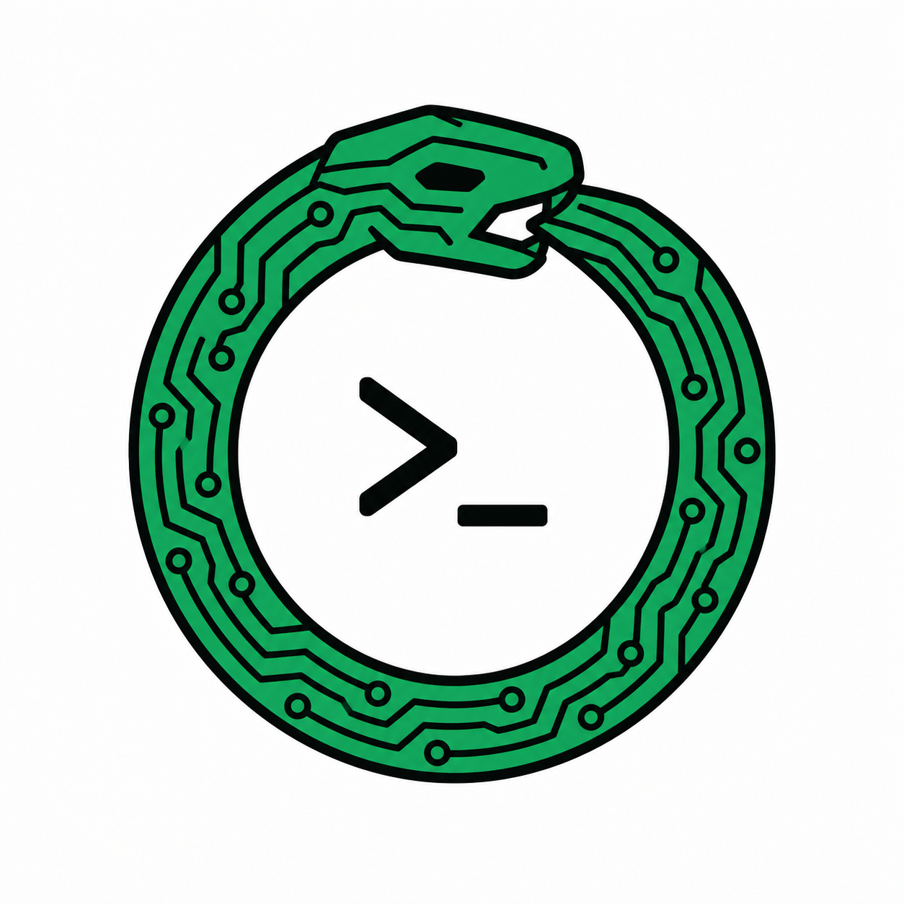

# Ouroboot



Ouroboot is a small, understandable, self-hosting computer system. Its C
compiler builds musl, BusyBox, a kernel, and another copy of itself. That
system then runs in a browser terminal on a RISC-V64 emulator written in C and
compiled to WebAssembly by the same compiler.

**[Try the browser demo](https://prc33.github.io/ouroboot/emulator/web/)**

```text
host C compiler → TCC → musl + BusyBox + kernel + guest TCC
                         └→ wasm32 TCC → RV64 emulator.wasm → browser
```

The point is the complete path from C source to an interactive system that can
rebuild itself—not a production operating system or toolchain. RISC-V64 is the
primary system; i386 remains a second implementation and self-hosting check.

## Development provenance

The project was developed entirely through [Codex](https://openai.com/codex/)
and [Claude Code](https://www.anthropic.com/claude-code), with no manual commits.

## Quick start

You need a POSIX shell, host C compiler, Make, Git, Bash, Python 3, and a
modern browser. The first build fetches musl and BusyBox.

```sh
make -C compiler TARGET=riscv64
./demo/build-musl-riscv64.sh
./demo/build-busybox-riscv64.sh
make -C kernel ARCH=riscv64 kernel.elf tcc-initrd
make -C compiler TARGET=wasm32
make -C emulator
python3 -m http.server 8000
```

Open <http://localhost:8000/emulator/web/>. At the BusyBox prompt, run:

```sh
ls
cat hello.c
ash /selfhost.sh
```

The script rebuilds TCC inside Ouroboot, uses it to compile `hello.c`, and runs
the result. The browser emulator is an interpreter, so this is deliberately
slower than native execution.

For a freestanding C99 conformance smoke test, clone
[`c-testsuite`](https://github.com/c-testsuite/c-testsuite) and run
`make -C compiler TARGET=i386 c99-conformance CTESTSUITE=/path/to/c-testsuite`.
This runs portable C99 cases that do not require a hosted libc; libc cases are
reported separately because Ouroboot supplies musl in the guest.

## Project map

- `compiler/` — reduced TinyCC with i386, RISC-V64, and wasm32 targets.
- `demo/` — reproducible musl/BusyBox source fetch, patch, and build scripts.
- `kernel/` — the small kernel, userspace fixtures, initrd builders, and tests.
- `emulator/` — shared C RV64 core, native runner, and browser frontend.
- `docs/` — current architecture and build/test documentation.

See [architecture](docs/architecture.md), [building and testing](docs/building.md),
and the [emulator README](emulator/README.md) for detail.

## Line-count budgets

Tracked implementation, build, and test files are counted; generated files and
subsystem README prose are not.

| Component | Limit or target | Current |
|---|---:|---:|
| Emulator | 1,000 hard limit | 1,000 |
| Kernel | 10,000 hard limit | 9,747 |
| Compiler | 25,000 target; 20,000 stretch | 26,697 |

## Origins

- [TinyCC](https://bellard.org/tcc/) — compiler foundation.
- [musl](https://musl.libc.org/) — guest C library and startup objects.
- [BusyBox](https://busybox.net/) — guest shell and core utilities.
- [Blosc MiniCC](https://github.com/Blosc/minicc) — starting point for the
  wasm32 backend.
- [mini-rv32ima](https://github.com/WillGreen/mini-rv32ima) and
  [jor1k](https://github.com/s-macke/jor1k) — emulator design and performance
  prior art.
- [xterm.js](https://xtermjs.org/) — browser terminal UI.
- [OpenSBI](https://github.com/riscv-software-src/opensbi) — QEMU RISC-V
  firmware environment.

Upstream licences and retained notices remain with their respective sources.
